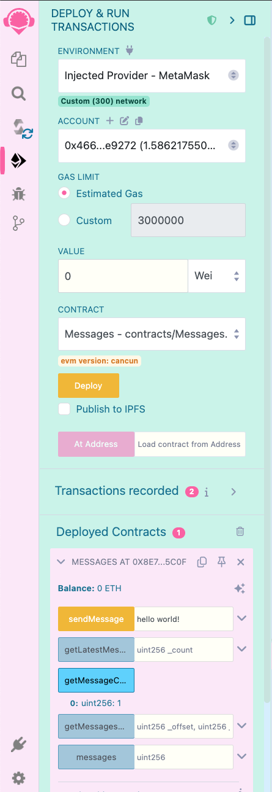

# Guía del Smart Contract de Mensajes

Esta guía explica el propósito y la funcionalidad del smart contract Messages y proporciona instrucciones paso a paso para desplegarlo utilizando Remix IDE.

## Descripción General del Contrato

El contrato Messages es un sistema de mensajería descentralizado que permite a los usuarios:

- Enviar mensajes que se almacenan en la blockchain
- Recuperar mensajes en lotes de manera eficiente
- Recibir notificaciones cuando se envían nuevos mensajes (a través de eventos)

### Características Principales

- **Paginación Eficiente**: En lugar de cargar todos los mensajes a la vez, el contrato permite recuperarlos en lotes
- **Orden Cronológico Inverso**: Los mensajes más recientes son siempre accesibles primero
- **Actualizaciones en Tiempo Real**: Los eventos notifican a las aplicaciones frontend cuando se añaden nuevos mensajes
- **Uso Optimizado de Gas**: Los métodos de acceso están diseñados para minimizar los costos de gas

## Explicación del Código del Contrato

Código fuente: [contracts/Messages.sol](../../contracts/Messages.sol)

### Desglose del Código

#### Almacenamiento de Datos
- Estructura `Message`: Define cada mensaje con la dirección del remitente, contenido y marca de tiempo
- Array `messages`: Array privado que contiene todos los mensajes.

#### Funciones

1. **sendMessage**
   - Acepta un mensaje de texto del remitente
   - Lo almacena con la dirección del remitente y la marca de tiempo del bloque actual
   - Emite un evento `NewMessage` con los detalles

2. **getMessagesBatch**
   - Implementa paginación con parámetros de offset y límite
   - Devuelve mensajes en orden cronológico inverso (los más recientes primero)
   - Verifica límites y optimiza el tamaño del lote

3. **getLatestMessages**
   - Acceso simplificado a los mensajes más recientes
   - Perfecto para la carga inicial en aplicaciones frontend

4. **getMessageCount**
   - Devuelve el número total de mensajes almacenados
   - Útil para cálculos de paginación

#### Eventos

- `NewMessage`: Se emite cuando se envía un nuevo mensaje
  - Contiene todos los datos del mensaje más un ID de mensaje
  - Tiene parámetros indexados para filtrado eficiente

## Despliegue con Remix IDE

Remix IDE es un entorno de desarrollo basado en navegador que no requiere instalación. Así es como se despliega el contrato Messages:

### Paso 1: Acceder a Remix IDE

1. Abre tu navegador web y ve a [https://remix.ethereum.org/](https://remix.ethereum.org/)
2. Verás la interfaz de Remix IDE con un explorador de archivos a la izquierda

### Paso 2: Crear un Nuevo Archivo

1. Haz clic en el icono "+" en el panel del explorador de archivos
2. Nombra el archivo `Messages.sol`
3. Pega el código del contrato Messages (proporcionado anteriormente) en el editor

### Paso 3: Compilar el Contrato

1. Haz clic en la pestaña "Solidity Compiler" (2º icono en la barra lateral izquierda)
2. Asegúrate de que el desplegable "Compiler" muestre la versión 0.8.0 o una más reciente
3. Haz clic en el botón "Compile Messages.sol"
4. Si la compilación es exitosa, verás una marca de verificación verde

### Paso 4: Desplegar el Contrato

1. Haz clic en la pestaña "Deploy & Run Transactions" (3er icono en la barra lateral izquierda)
2. En el desplegable "Environment":
   - Selecciona "Injected Provider - MetaMask" para desplegar en una red real
   - O selecciona "Remix VM (Cancun)" para pruebas en un entorno simulado
3. Si usas MetaMask:
   - Asegúrate de que tu wallet MetaMask esté conectada a la red deseada (por ejemplo, ZKsync Sepolia Testnet, etc.)
   - Asegúrate de tener suficiente ETH/tokens para las tarifas de gas
4. En "Contract", selecciona "Messages" del desplegable
5. Haz clic en el botón "Deploy"

### Paso 5: Interactuar con el Contrato Desplegado

Después del despliegue, verás el contrato en la sección "Deployed Contracts":

1. Expande el contrato para ver todas las funciones disponibles
2. Para enviar un mensaje:
   - Introduce un mensaje en el campo junto a la función `sendMessage`
   - Haz clic en el botón `sendMessage`
   - Confirma la transacción en MetaMask (si estás usando una red real)
3. Para recuperar los mensajes más recientes:
   - Introduce un número (por ejemplo, 5) en el campo junto a `getLatestMessages`
   - Haz clic en el botón `getLatestMessages`
   - Ve los resultados en la consola de abajo
4. Para probar la paginación:
   - Usa `getMessagesBatch` con parámetros de offset y límite

### Paso 6: Ver el contrato en el explorador de bloques

1. Copia la dirección del contrato
2. Pégala en el [Explorador ZKsync Sepolia](https://explorer.zksync.io/)
3. Haz clic en la dirección del contrato para ver los detalles
4. Ve las transacciones y eventos en el contrato.

### Paso 7: Obtener Información del Contrato para Integración Frontend

1. Después del despliegue exitoso, copia:
   - La dirección del contrato (mostrada junto al nombre del contrato)
   - El ABI del contrato (desde "Compilation Details" en la pestaña del compilador)
2. Estos serán necesarios para la integración con tu frontend React

## Consideraciones de Prueba

Remix proporciona una interfaz rápida para desplegar contratos, pero no es ideal para pruebas. Considera usar [Hardhat](https://hardhat.org/) o [Foundry](https://getfoundry.sh/) que te permiten ejecutar un nodo local y escribir un conjunto completo de pruebas. 
